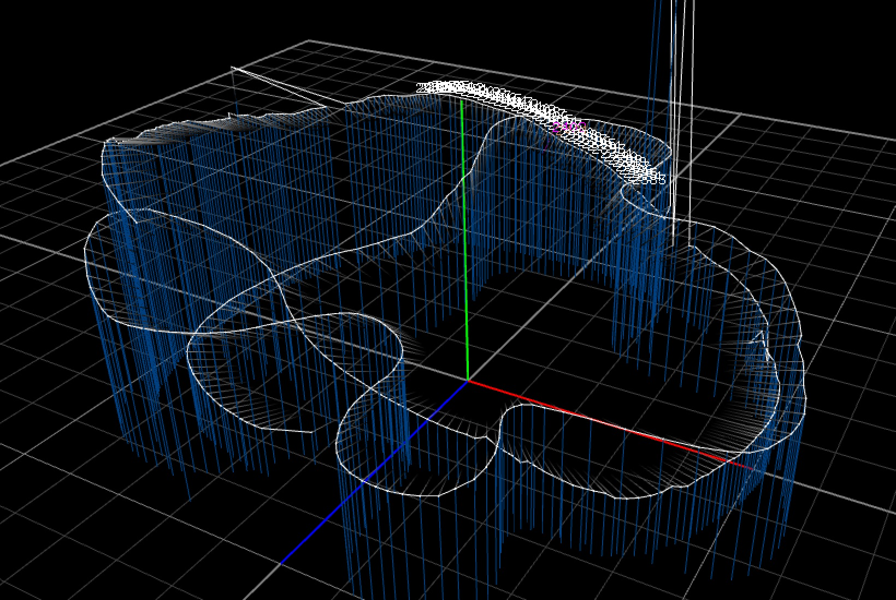

# imai - Fly feat. 79, Kaho Nakamura

[MV本編](https://www.youtube.com/watch?v=iQi3aMQXip8) | [撮影風景](https://www.youtube.com/watch?v=dXoeCv-BxJw)

ほぼそのままアップしただけでして、非常に雑です。とりあえずこの撮影で使えれば良かったので、僕の環境以外動きません。

## Applications

 - CamGraph: Working with Dragonframe, this app visualizes how the camera has moved. Built with oF 0.9.8.
 - dragonframe-osc: Notify Dragonframe's events as OSC.
 - tracker2osc: Send a coordinate of Vive Tracker as OSC.

## 座標系の変換まわり

Vive Trackerで取得できる座標系は、ベースステーションが原点になっているため、視覚的にわかりやすくするために、以下の手順でカメラキャリブレーションしています。

1. 原点をセット
2. +X軸の方向に三脚を移動させてセット
3. 三脚を別方向にスライドさせてセット（XZ平面が定まる）
4. カメラをベースステーションに向け、アングルをセット（カメラ - Vive Tracker間の角度が定まる）

カメラとシューに取り付けられたViveTracker間の位置は、適当に図ってオフセットさせています。

## License

This plugin is published under a MIT License so far. See the included [LICENSE file](./LICENSE).
